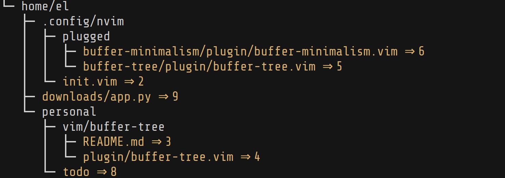

```

 ,dPYb,                 ,dPYb, ,dPYb,                        I8
 IP'`Yb                 IP'`Yb IP'`Yb                        I8
 I8  8I                 I8  8I I8  8I                     88888888
 I8  8'                 I8  8' I8  8'                        I8
 I8 dP      gg      gg  I8 dP  I8 dP   ,ggg,    ,gggggg,     I8    ,gggggg,   ,ggg,    ,ggg,
 I8dP   88ggI8      8I  I8dP   I8dP   i8" "8i   dP""""8I     I8    dP""""8I  i8" "8i  i8" "8i
 I8P    8I  I8,    ,8I  I8P    I8P    I8, ,8I  ,8'    8I    ,I8,  ,8'    8I  I8, ,8I  I8, ,8I
,d8b,  ,8I ,d8b,  ,d8b,,d8b,_ ,d8b,_  `YbadP' ,dP     Y8,  ,d88b,,dP     Y8, `YbadP'  `YbadP'
8P'"Y88P"' 8P'"Y88P"`Y8PI8"888PI8"888888P"Y8888P      `Y8  8P""Y88P      `Y8888P"Y888888P"Y888
                        I8 `8, I8 `8,
                        I8  `8,I8  `8,
                        I8   8II8   8I
                        I8   8II8   8I
                        I8, ,8'I8, ,8'
                         "Y8P'  "Y8P'
```
<h3>A small heads-up</h3>
Since developing this plugin, I've also developed <a href=https://github.com/el-iot/buffer-tree-explorer>buffer-tree-explorer</a>. I personally prefer <code>buffer-tree-explorer</code>, as it's just more usable (by its nature). Check it out if you're interested!

<h1>buffer-tree</h1>


A vim-plugin for rendering your buffer-list as an ascii-tree, written entirely in Vimscript. <br/><br/>


<p>The image on the right shows how the buffer-tree behaves when <code>g:buffertree_compress=1</code> and the <code>BufferTreeFile</code> highlight group is set to <code>yellow</code>.<p><br/>

<h2>Why?</h2>
I am a fan of both <a href='https://github.com/jceb/vmux'>vmux</a> and <a href='https://github.com/tpope/vim-obsession'>vim-obsession</a>, so I often have a <b>lot</b> of vim-buffers open at once. Sometimes it can be hard to parse where all of my buffers are using the <code>:buffers</code> command because the buffers are often listed in an inconvenient order, and the paths are quite long. As an example:

```
:buffers
  1  h   "~/.config/nvim/init.vim"      line 234
 22  h   "~/.config/nvim/demo.txt"      line 1
 23  h   "plugin/tree.py"               line 27
 25  h   "~/.config/nvim/autoload/plug.vim" line 563
 27 #h   "plugin/buffer-tree.vim"       line 91
 28 %a   "README.md"                    line 35
```

<code>BufferTree</code> lets you view your vim-buffers in an ascii-tree format instead.

```
:BufferTree
└─ home
   └─ el
      ├─ personal
      │  └─ vim
      │     └─ buffer-tree
      │        ├─ README.md ⇒ 28
      │        └─ plugin
      │           ├─ tree.py ⇒ 23
      │           └─ buffer-tree.vim ⇒ 27
      └─ .config
         └─ nvim
            ├─ demo.txt ⇒ 22
            ├─ autoload
            │  └─ plug.vim ⇒ 25
            └─ init.vim ⇒ 1
```

Note that the numbers after the arrow next to each file represent the buffer numbers of each file.

<h2>Installation</h2>

Add this line to your <code>init.vim</code> / <code>.vimrc</code> file:
```
Plug 'el-iot/buffer-tree.vim'
```
then <code>source</code> the file and run <code>PlugInstall</code> (though you may need to modify it slightly if you use a different plugin manager).

<h2>Usage</h2>
All you need is the <code>BufferTree</code> command.

<h2>Configuration</h2>

<h3> Compressing the BufferTree </h3>
Sometimes your buffers will be very sparse and the buffer-tree will look a little large for so few files.
As an example,

```
└─ home
   └─ el
      ├─ personal
      │  ├─ vim
      │  │  └─ buffer-tree
      │  │     ├─ README.md ⇒ 2
      │  │     └─ plugin
      │  │        └─ buffer-tree.vim ⇒ 3
      │  └─ repos
      │     └─ themerator
      │        └─ themerator.py ⇒ 14
      └─ .config
         └─ nvim
            ├─ plugged
            │  ├─ buffer-tree
            │  │  └─ plugin
            │  │     └─ buffer-tree.vim ⇒ 4
            │  └─ buffer-minimalism
            │     └─ plugin
            │        └─ buffer-minimalism.vim ⇒ 10
            └─ init.vim ⇒ 1
```

This is a little inconvenient, as a lot of vertical space is taken up by directories with no buffers.
You can set <code>g:buffertree_compress</code> to 1 to "compress" your trees where possible. In this case, the tree above would look like

```
└─ home/el
   ├─ .config/nvim
   │  ├─ plugged
   │  │  ├─ buffer-minimalism/plugin/buffer-minimalism.vim ⇒ 10
   │  │  └─ buffer-tree/plugin/buffer-tree.vim ⇒ 4
   │  └─ init.vim ⇒ 1
   └─ personal
      ├─ repos/themerator/themerator.py ⇒ 14
      └─ vim/buffer-tree
         ├─ README.md ⇒ 2
         └─ plugin/buffer-tree.vim ⇒ 3

```

<h3>Highlight groups</h3>
The plugin uses a highlight group <code>BufferTreeFile</code> to highlight files to make it easier to parse the relevant parts of the tree.

<h3>Modifying the "arrow"</h3>
The "⇒" character is used by default for separating the file path and buffer number, but this can be customised using the `g:buffertree_arrow` global variable.

<h3>Modifying the default file-path separator</h3>
On Windows systems the backwards slash character (<code>\</code>) is used by as the file-path separator and initially buffer-tree will not render the ascii tree correctly and the tree will be "flat", i.e.

```
BufferTree
├─ C:\the\path\to\file\one
├─ C:\the\path\to\file\two
├─ C:\the\different\path\to\file\three
├─ C:\the\different\path\to\file\four
└─ D:\the\path\to\file\five
```

This is because the plugin separates each sub-directory in a path according to the `g:buffertree_path_sep` global variable (set to `/` by default). If you are using a Windows system or notice that buffer-tree is not nesting properly then change the value of `g:buffertree_path_sep`.

<h2>Contributing</h2>
Please do! If you find the plugin useful then any contributions are welcome. Things that need doing:<br>
 - add line number and column number for each buffer
